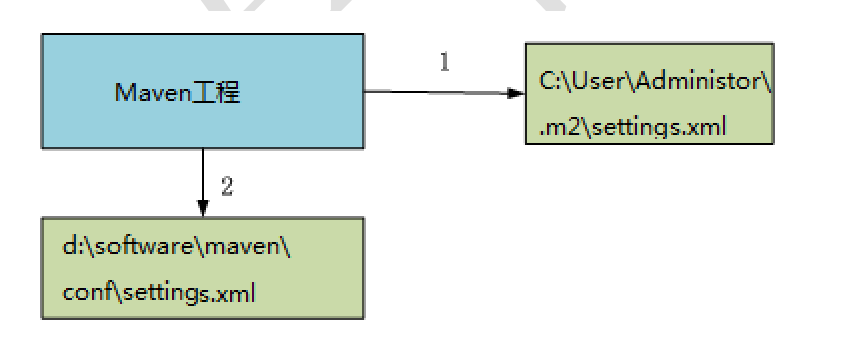

# day01_01maven_conflict
- 解决maven工程中jar包依赖问题方案  
    1.直接依赖优先级大于传递依赖  
    2.第一声明优先原则：哪个jar包的坐标在靠上的位置，这个jar包就是先声明的(适用于间接依赖)  
    3.排除法，配置exclusions标签(推荐)

# day01_02maven_multi_module
- maven多工程拆分讲解
    - mvc三层架构的拆分
    - 拆分完成后三种启动方式  
        a.使用父工程的tomcat插件启动day01_02maven_multi_module->Plugins->tomcat7->tomcat7:run  
        b.使用本地tomcat启动  
        c.先使用父工程day01_02maven_multi_module->lifecycle->install安装所有模块，然后再启动maven_web模块Plugins->tomcat7->tomcat7:run
        
# Maven

## 全局 setting 与 与户 用户 setting

​		maven 仓库地址、私服等配置信息需要在 setting.xml 文件中配置，分为全局配置和用户配置。
在 maven 安装目录下的有 conf/setting.xml 文件，此 setting.xml 文件用于 maven 的所有 project
项目，它作为 maven 的全局配置。
​		如需要个性配置则需要在用户配置中设置，用户配置的 setting.xml 文件默认的位置在：${user.dir}
/.m2/settings.xml 目录中,${user.dir} 指windows 中的用户目录。
​		maven会先找用户配置，如果找到则以用户配置文件为准，否则使用全局配置文件



### 配置示例

在C:\Users\xxxx\\.m2的settings.xml(没有就创建)中设置如下内容

```xml
<?xml version="1.0" encoding="UTF-8"?>
<settings xmlns="http://maven.apache.org/SETTINGS/1.0.0"
          xmlns:xsi="http://www.w3.org/2001/XMLSchema-instance"
          xsi:schemaLocation="http://maven.apache.org/SETTINGS/1.0.0 http://maven.apache.org/xsd/settings-1.0.0.xsd">
	  
  <!-- server， username和password与nexus保持一致-->
    <servers>
      <server>
        <id>releases</id>
        <username>admin</username>
        <password>admin</password>
      </server>
      <server>
        <id>snapshots</id>
        <username>admin</username>
        <password>admin</password>
      </server>
    </servers>

    <!-- 设置maven本地仓库地址 -->
    <localRepository>D:/Develop/MavenRepo</localRepository>

    <!-- 设置maven下载源 -->
    <mirrors>
        <!-- mirror
         | Specifies a repository mirror site to use instead of a given repository. The repository that
         | this mirror serves has an ID that matches the mirrorOf element of this mirror. IDs are used
         | for inheritance and direct lookup purposes, and must be unique across the set of mirrors.
         |
        <mirror>
          <id>mirrorId</id>
          <mirrorOf>repositoryId</mirrorOf>
          <name>Human Readable Name for this Mirror.</name>
          <url>http://my.repository.com/repo/path</url>
        </mirror>
         -->

        <mirror>
            <id>alimaven</id>
            <name>aliyun maven</name>
            <url>http://maven.aliyun.com/nexus/content/groups/public/</url>
            <mirrorOf>central</mirrorOf>
        </mirror>

        <mirror>
            <id>uk</id>
            <mirrorOf>central</mirrorOf>
            <name>Human Readable Name for this Mirror.</name>
            <url>http://uk.maven.org/maven2/</url>
        </mirror>

        <mirror>
            <id>CN</id>
            <name>OSChina Central</name>
            <url>http://maven.oschina.net/content/groups/public/</url>
            <mirrorOf>central</mirrorOf>
        </mirror>

        <mirror>
            <id>nexus</id>
            <name>internal nexus repository</name>
            <!-- <url>http://192.168.1.100:8081/nexus/content/groups/public/</url>-->
            <url>http://repo.maven.apache.org/maven2</url>
            <mirrorOf>central</mirrorOf>
        </mirror>

    </mirrors>

</settings>
```

在工程的pom.xml设置如下

```xml

<!--上传到本地私服-->
<distributionManagement>
    <repository>
        <!--与settings.xml的server id保持一致-->
        <id>releases</id>
        <!--nexus地址-->
        <url>http://localhost:8081/repository/maven-releases/</url>
    </repository>
    <snapshotRepository>
        <id>snapshots</id>
        <url>http://localhost:8081/repository/maven-snapshots/</url>
    </snapshotRepository>
</distributionManagement>
```

# Nexus

 https://www.cnblogs.com/tiancai/p/10063572.html 

https://www.cnblogs.com/endv/p/11204704.html

gradle上传: https://www.cnblogs.com/yjmyzz/p/auto-upload-artifact-to-nexus.html 

# 安装第三方jar

## 安装到本地仓库

--进入jar包所在目录

```cmake
mvn install:install-file "-DgroupId=com.alibaba" "-DartifactId=fastjson" "-Dversion=1.1.37" "-Dfile=fastjson-1.1.37.jar" "-Dpackaging=jar"
```

----打开cmd直接运行

```cmake
mvn install:install-file "-DgroupId=com.alibaba" "-DartifactId=fastjson" "-Dversion=1.1.37" "-Dpackaging=jar" "-Dfile=C:\Users\robincxiao\Desktop\test\fastjson-1.1.37.jar"
```

## 安装到私服

--在settings配置文件中添加登录私服第三方登录信息
<server>
<id>snapshots</id>
<username>admin</username>
<password>admin</password>
</server>
----进入jar包所在目录运行

```java
mvn deploy:deploy-file "-DgroupId=com.alibaba" "-DartifactId=fastjson" "-Dversion=1.1.37-SNAPSHOT" "-Dpackaging=jar" "-Dfile=fastjson-1.1.37.jar" "-Durl=http://localhost:8081/repository/maven-snapshots/" "-DrepositoryId=snapshots"
```

```java
mvn deploy:deploy-file "-DgroupId=com.alibaba" "-DartifactId=fastjson" "-Dversion=1.1.37" "-Dpackaging=jar" "-Dfile=fastjson-1.1.37.jar" "-Durl=http://localhost:8081/repository/maven-releases/" "-DrepositoryId=releases"
```

## 注意事项

- version与repositoryId必须对应

| -DrepositoryId | -Dversion                            |
| -------------- | ------------------------------------ |
| snapshots      | 版本名必须以SNAPSHOT结尾(必须是大写) |
| releases       | 可以不以RELEASES结尾                 |

- 在windows的powerShell中使用命令mvn install和mvn deploy时，后面所有参数都要添加""，如果是CMD则不需要

## 参考

```
1. 如何将组件标记为SNAPSHOT：

在POM文件里，有<version>节点，这个节点如果以SNAPSHOT结尾（注意这里必须是全大写），那么就会识别成SNAPSHOT版，否则就是release版。这里需要注意的是《Maven权威指南》的英文版里说的If a version contains the string “-SNAPSHOT,”是错误的，因为当SNAPSHOT在中间，而不是结尾的时候，比如"1.0-SNAPSHOT-a"仍然会被认为是release版，并且连接符也不需要，比如”1.0SNAPSHOT“也是SNAPSHOT版
————————————————
版权声明：本文为CSDN博主「zhu19774279」的原创文章，遵循CC 4.0 BY-SA版权协议，转载请附上原文出处链接及本声明。
原文链接：https://blog.csdn.net/zhu19774279/article/details/8585629/
```


